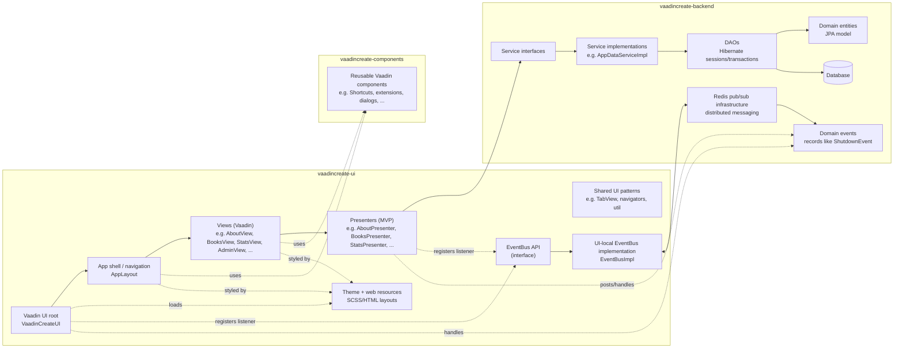

# Application Architecture

This project is organized as a multi-module Maven build with three main modules:

- **vaadincreate-ui**: Vaadin UI layer (views + presenters) and UI-local infrastructure (notably the event bus implementation).
- **vaadincreate-backend**: domain model, DAOs, services, and infrastructure (e.g., Redis pub/sub) that emits domain events.
- **vaadincreate-components**: reusable Vaadin components/utilities shared across UI.

## Layering (typical call flow)

`View (Vaadin UI) → Presenter (MVP) → Service → DAO → Database`

Cross-cutting:

- Shared UI building blocks are provided by **vaadincreate-components**.
- UI styling/layout resources live in **vaadincreate-ui** under `src/main/webapp/VAADIN/themes/...`.
- UI-local **EventBus** dispatches events (and can bridge to backend Redis pub/sub).

## Mermaid diagram

