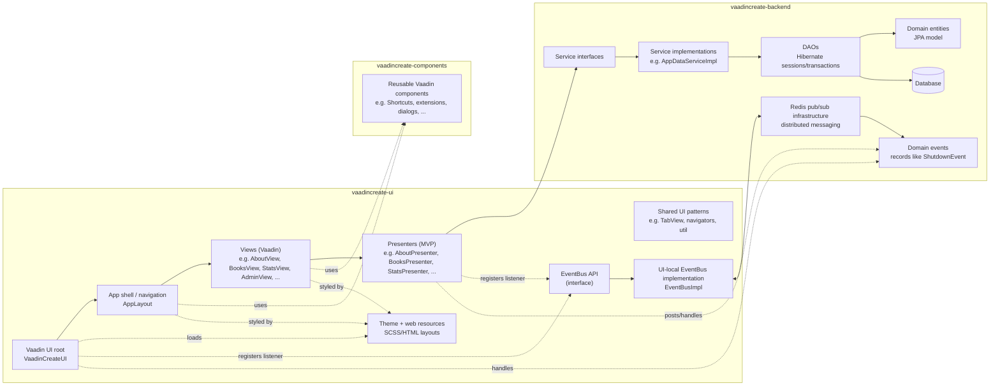

# Application Architecture

This project is organized as a multi-module Maven build with three main modules:

- **vaadincreate-ui**: Vaadin UI layer (views + presenters) and UI-local infrastructure (notably the event bus implementation).
- **vaadincreate-backend**: domain model, DAOs, services, and infrastructure (e.g., Redis pub/sub) that emits domain events.
- **vaadincreate-components**: reusable Vaadin components/utilities shared across UI.

## Layering (typical call flow)

`View (Vaadin UI) → Presenter (MVP) → Service → DAO → Database`

Cross-cutting:

- Shared UI building blocks are provided by **vaadincreate-components**.
- UI styling/layout resources live in **vaadincreate-ui** under `src/main/webapp/VAADIN/themes/...`.
- UI-local **EventBus** dispatches events (and can bridge to backend Redis pub/sub).

## Mermaid diagram

## Architecture enforcement (ArchUnit tests)

The UI module contains ArchUnit-based architecture tests that act as an automated safety net for the boundaries described above. The rules live in `vaadincreate-ui/src/test/java/org/vaadin/tatu/vaadincreate/ArchitectureTest.java` and are executed as part of the normal Maven test lifecycle.

These tests are intentionally strict: if a dependency or convention breaks a rule, the build fails early.

### Enforced dependency boundaries

The rules currently enforced by ArchUnit include:

- **Services are not a general-purpose dependency from UI code.** Backend classes whose name ends with `Service` may only be accessed by:
  - Presenter classes (`*Presenter`)
  - `VaadinCreateUI`
  - classes in `..auth..` and `..backend..`
  - a small set of UI-local infrastructure classes (e.g. event bus and locking internals)

- **DAOs are only accessed from services (and other DAOs).** Classes ending with `Dao` may only be accessed by classes under `..service..` or `..dao..`.

- **Hibernate access is restricted to DAOs.** Code outside `..dao..` must not access `SessionFactory` or `HibernateUtil`.

- **Service implementations are backend-internal.** Classes ending with `ServiceImpl` under `..backend..` must only be accessed by other backend classes (enforcing interface-based usage outside the backend).

- **Presenters must not depend on Vaadin APIs.** Classes ending with `Presenter` must not access classes in `com.vaadin..`.

- **EventBus usage is restricted.** Event bus classes are only accessed by presenters, `VaadinCreateUI`, servlets/tests, and a small set of internal packages.
  - `EventBusImpl` is only accessed through `EventBus` (plus tests).

- **Locking implementation is hidden behind an interface.** `LockedObjectsImpl` is only accessed through `LockedObjects` (or by itself).

- **Shell/view wiring is constrained.**
  - `AppLayout` is only accessed by `VaadinCreateUI` (plus tests/self references).
  - `LoginView` is only accessed by `VaadinCreateUI` (plus tests/self references).
  - `ErrorView` is only accessed by `AppLayout` (plus itself).

- **Access control implementation is hidden behind an interface.** `BasicAccessControl` is only accessed via `AccessControl` (plus `VaadinCreateUI`/itself).

### Enforced UI conventions

The tests also enforce a set of UI-side conventions for view classes:

- **Views have access control annotations.** Classes in `org.vaadin.tatu.vaadincreate` ending with `View` and implementing Vaadin Navigator `View` must be annotated with either `@AllPermitted` or `@RolesPermitted`.

- **Views implement expected interfaces.** Non-interface classes in `org.vaadin.tatu.vaadincreate` ending with `View` must implement either `View` or `TabView`, and must implement `HasI18N`.

- **Lifecycle overrides call super.** Any `attach()` or `detach()` method declared in `org.vaadin.tatu.vaadincreate` must call `attach()` / `detach()` in its body (intended to ensure `super.attach()` / `super.detach()` is invoked).

And a few general conventions are enforced:

- **I18n constants are constants.** Fields in `I18n` must be `static final`.
- **Theme constants are constants.** Fields in `VaadinCreateTheme` must be `static final`.
- **Utility methods are static.** Methods in classes under `org.vaadin.tatu.vaadincreate.util` must be `static`.

