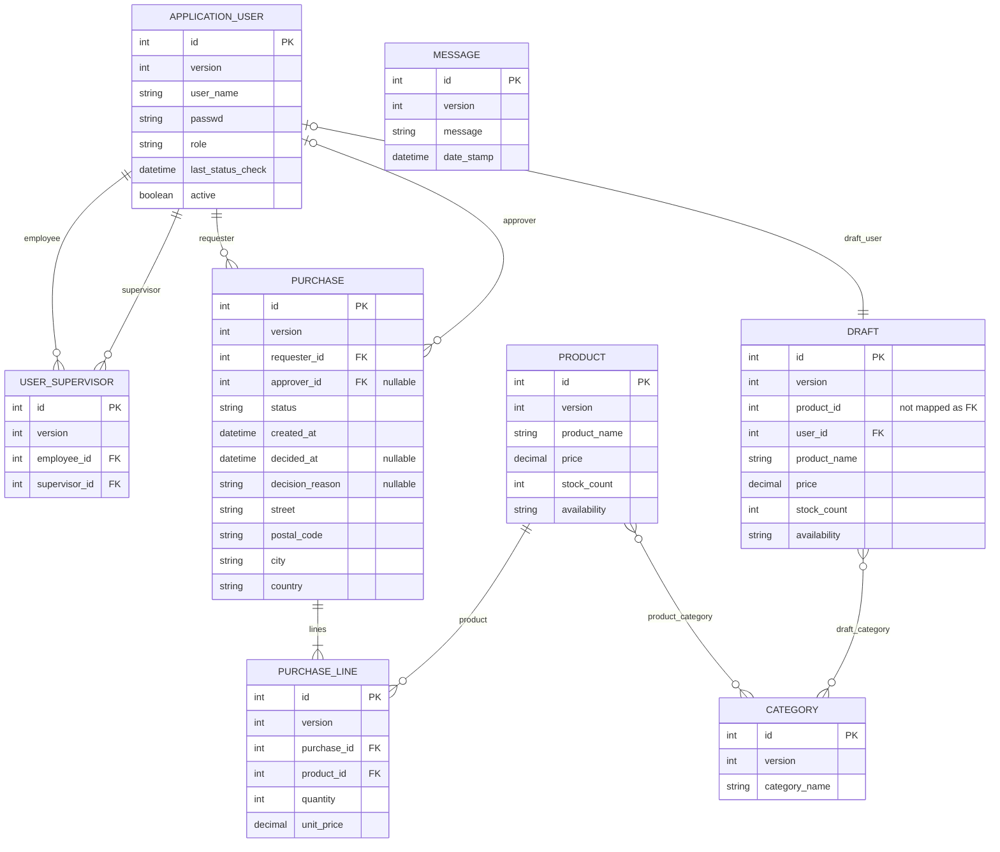

# VaadinCreate backend data model

This diagram is generated by inspecting the entity classes in `vaadincreate-backend/src/main/java/org/vaadin/tatu/vaadincreate/backend/data`.

- Mermaid source: [DataModel.mmd](DataModel.mmd)
- Rendered diagram: [DataModel.svg](DataModel.svg)

## Notes / interpretation

- Persistent JPA entities: `User`, `UserSupervisor`, `Purchase`, `PurchaseLine`, `Product`, `Category`, `Draft`, `Message`.
- Value object: `Address` is `@Embeddable` and is stored as columns on `Purchase` (street/postal_code/city/country).
- Enums stored as strings: `Availability`, `PurchaseStatus`, `User.Role`.
- `Cart` is an in-memory model only (not a database entity).
- `Draft.productId` is stored as an integer column and is not mapped as a JPA relationship to `Product`.

## ER diagram (Mermaid)

