# VaadinCreate Wireframes

This file augments `docs/VaadinCreate.PRD.md` with framework-agnostic visual composition specs.
It is intentionally more detailed than flow diagrams, but lighter than pixel-perfect screenshots.

## 1. How To Read These Mocks

Notation:
- `[]` container, panel, or card
- `()` interactive control
- `<>` data view (grid, list, chart)
- `{}` transient UI (toast, dialog)

Sizing and spacing guidance (rough):
- Desktop canvas: 1280 to 1440 px wide.
- Main shell columns: nav rail ~240 px + content fills remaining width.
- Common spacing scale: 8, 12, 16, 24 px.
- Typical card/panel radius: 6 to 8 px.
- Form label to input spacing: ~8 px.
- Section to section spacing: ~16 to 24 px.

## 2. Global App Shell (All Authenticated Views)

### 2.1 Desktop Shell

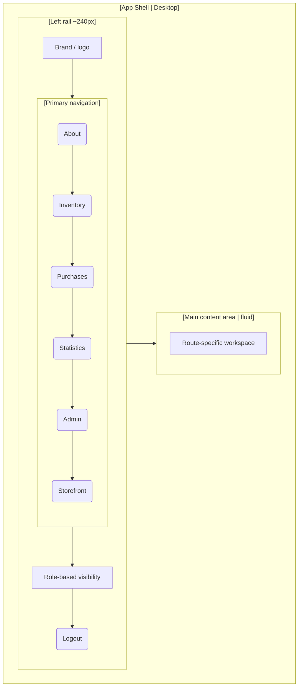

### 2.2 Narrow Window Shell

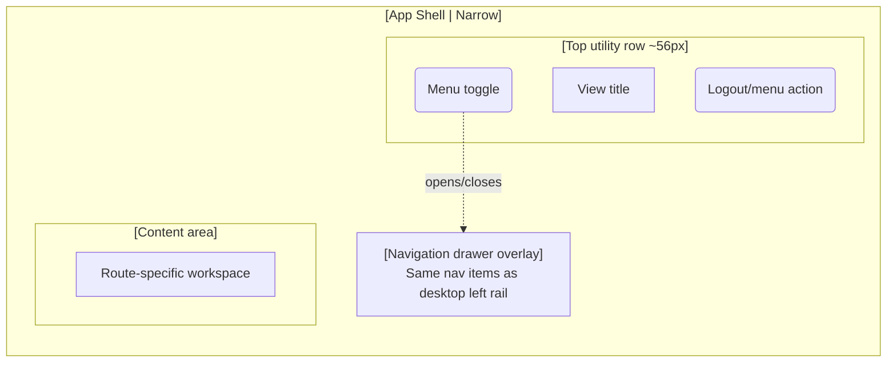

Callouts:
- Desktop uses a left vertical rail; the utility/action area is in that rail, not as a right-side top column.
- Top utility row is a narrow-window/mobile behavior.
- Only one nav item is active at a time.
- `Storefront` is customer/employee-facing; `Purchases` and `Admin` are supervisor/admin-facing.

## 3. Login View

### 3.1 Desktop Mock

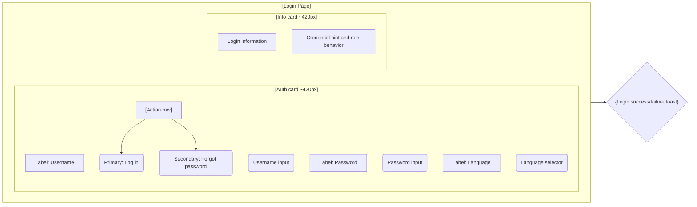

### 3.2 Mobile Mock

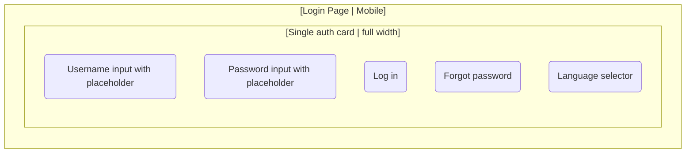

Callouts:
- Desktop shows info card; mobile hides it.
- Mobile uses placeholders where labels are reduced.

## 4. About View

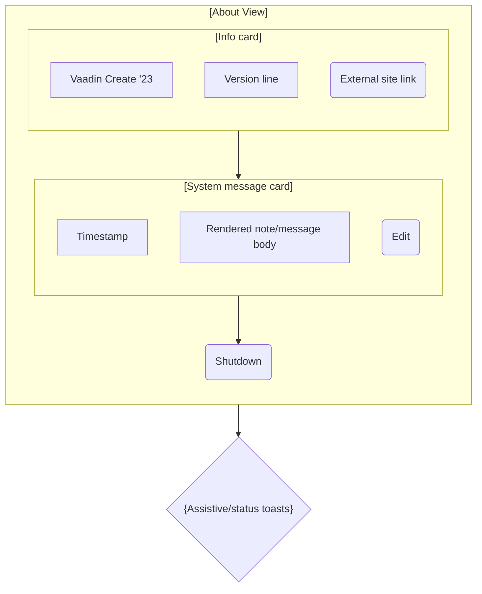

Callouts:
- In admin context, shutdown action is visible.
- Note panel is a single-message focal card (not a feed list).

## 5. Inventory View

### 5.1 Base Layout

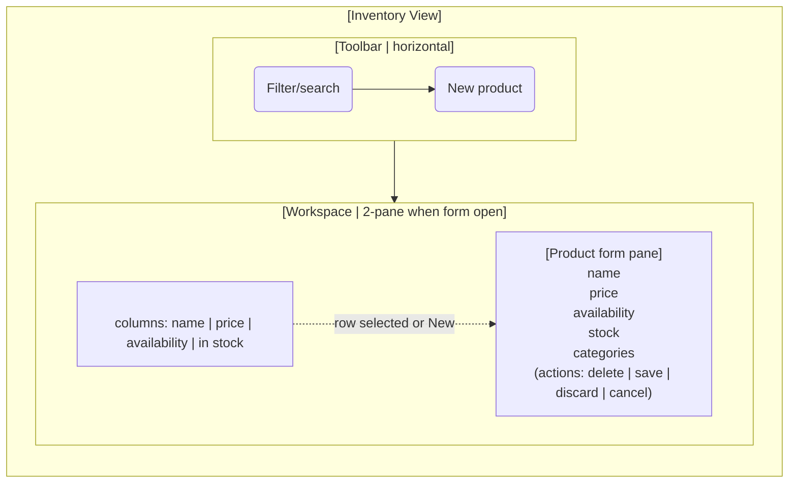

### 5.2 Product Form Detail

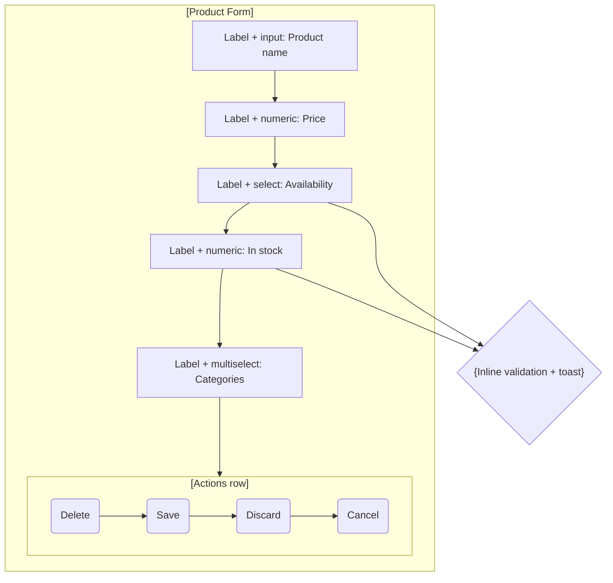

Callouts:
- Form can behave as a side pane/drawer relative to grid.
- Save/Discard stay disabled until valid and dirty.

## 6. Statistics View

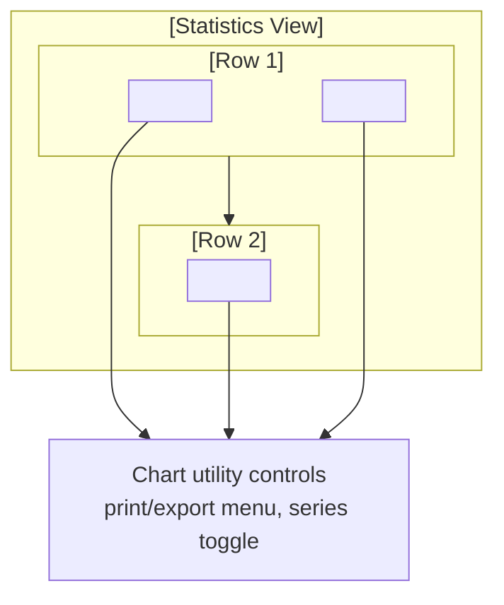

Callouts:
- Three chart cards with clear spacing and equal visual weight in row 1.
- Category chart is denser and typically spans full row width.

## 7. Purchases View (Supervisor/Admin)

### 7.1 View Shell

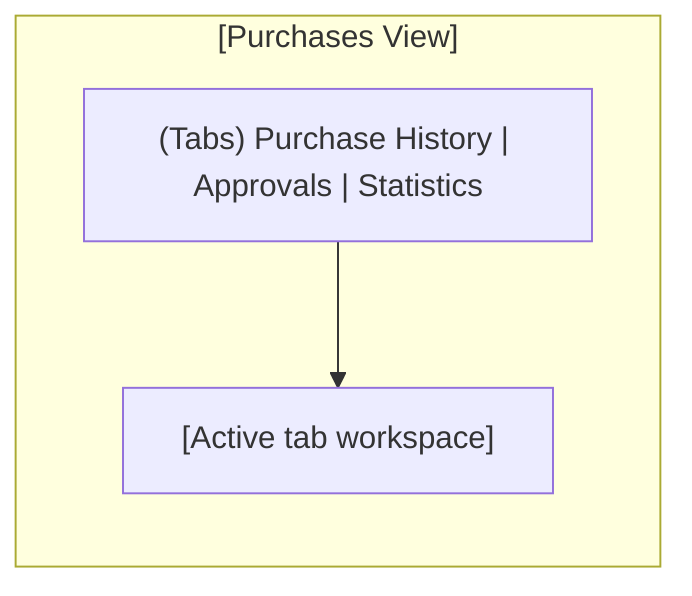

### 7.2 Purchase History Tab

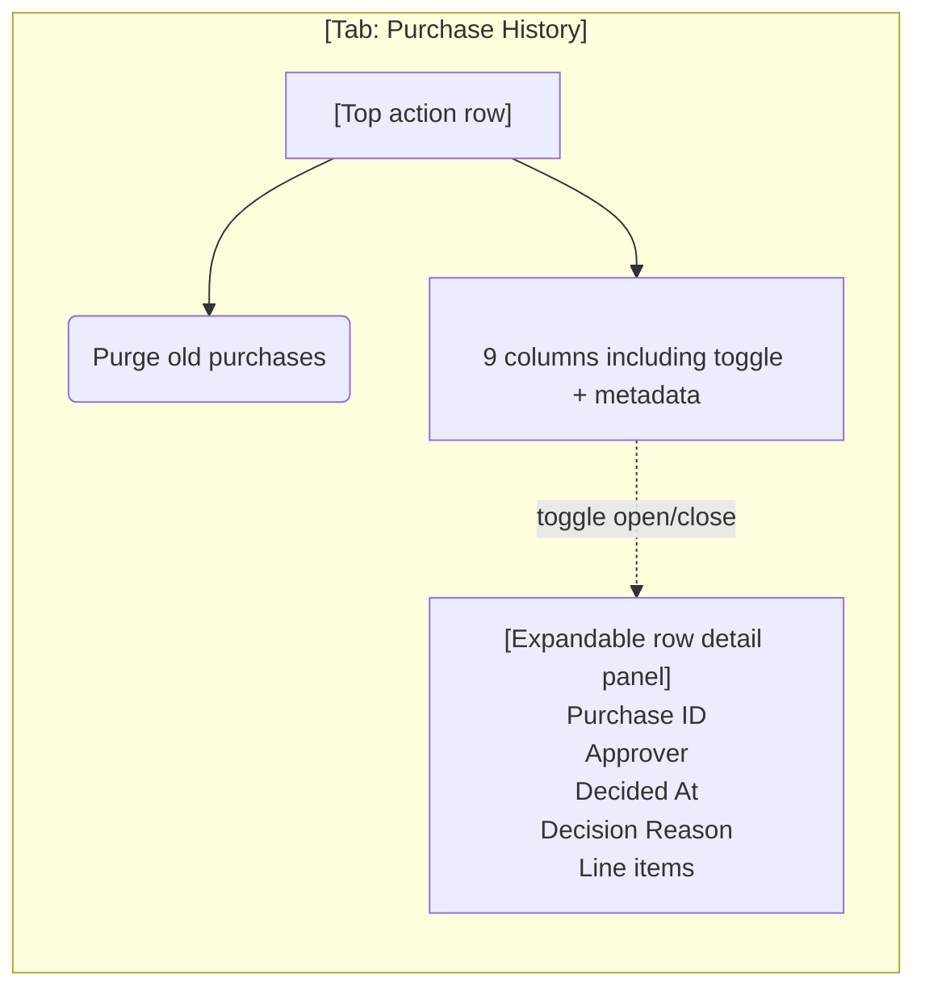

### 7.3 Approvals Tab

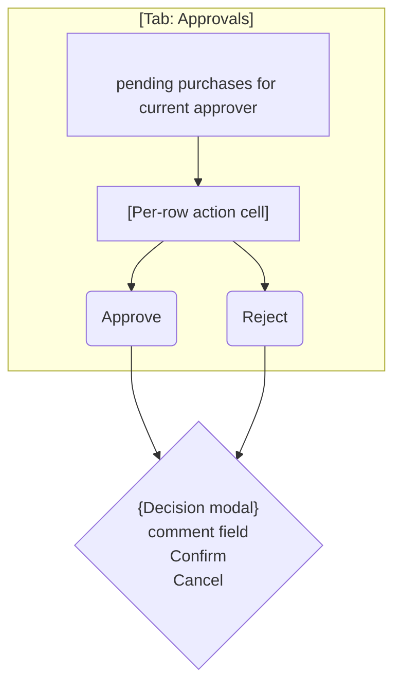

### 7.4 Statistics Tab

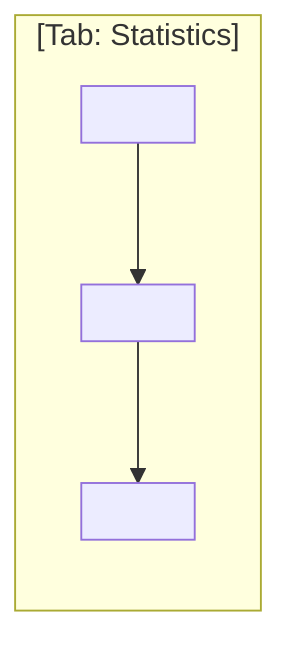

Callouts:
- Tabs are peer workspaces, not wizard steps.
- History and approvals are grid-first, with actions and details attached to rows.

## 8. Admin View

### 8.1 View Shell

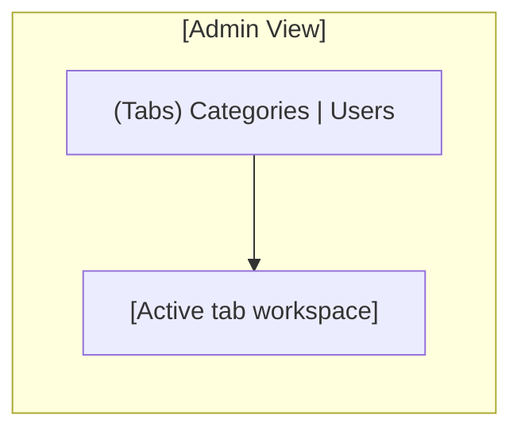

### 8.2 Categories Tab

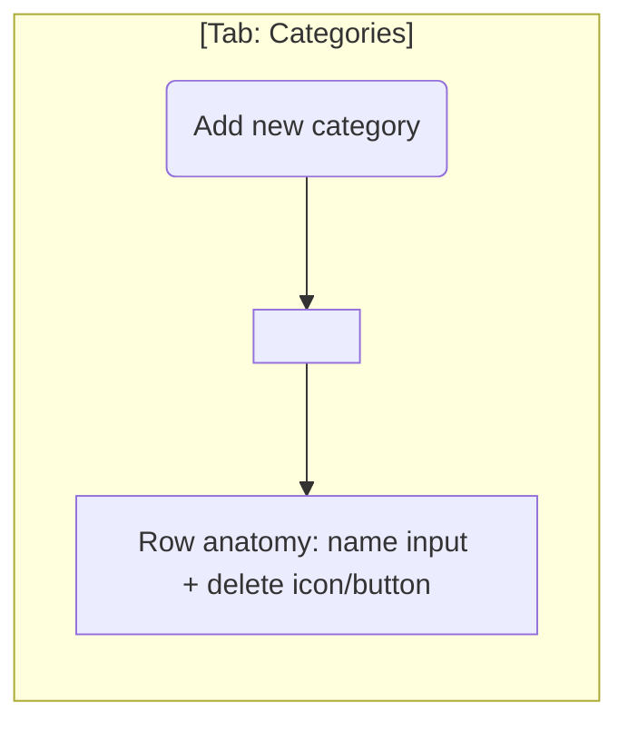

### 8.3 Users Tab

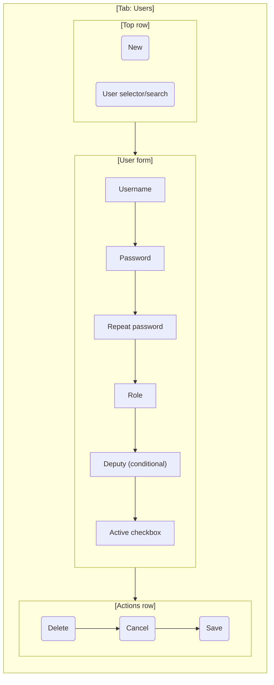

Callouts:
- Users form is a vertical form stack with a separate action bar.
- Actions row is at the bottom of the Users workspace.
- Deputy field is hidden by default and appears only when deputy assignment is required.

## 9. Storefront View (Customer)

### 9.1 Two-Pane Composition

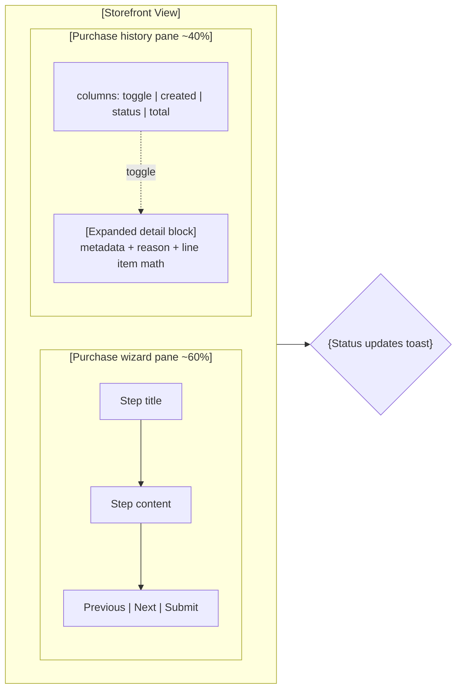

### 9.2 Wizard Step Mocks

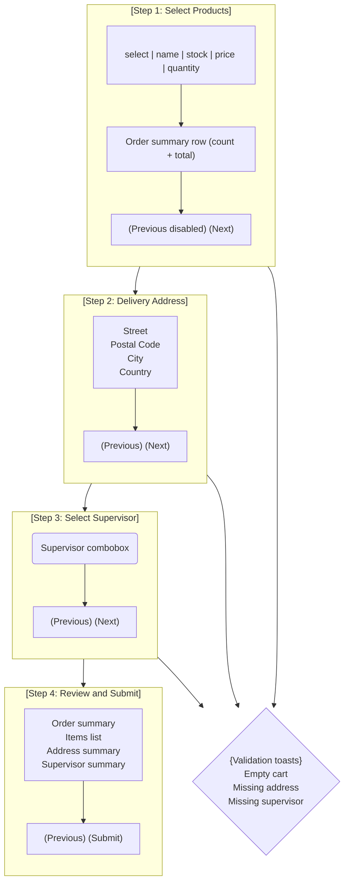

Callouts:
- Wizard remains in left pane; right history pane stays visible for context.
- Expanded history detail should read like a compact receipt.

## 10. Error/Fallback View

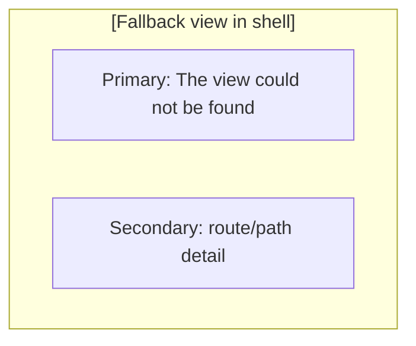

## 11. Implementation-Oriented Notes

- Keep toolbar/actions visually detached from data grids using a dedicated row.
- Keep row-detail content inside grid context; do not navigate away for details.
- Use consistent action order in form footers: destructive/secondary left, primary save right.
- Preserve persistent context panes where defined (Storefront wizard + history).
- Ensure tab workspaces maintain their internal state when switching tabs.
